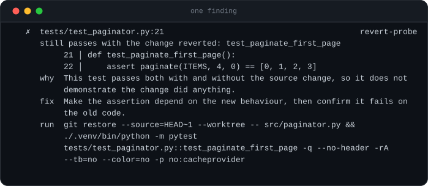

# unfaked

**Your agent said it's done. `unfaked` checks whether it made that true, or just made the check pass.**

<p align="center">
  
</p>

A coding agent that cannot finish a task can always finish the *report*. It skips
the failing test, widens the assertion, wraps the crash in `except: pass`, or adds
tests that pass no matter what the code does. The suite goes green, the summary
says "all tests passing", and nothing was fixed.

`unfaked` reads the diff and the repository, never the agent's prose. Zero
dependencies, no API key, no LLM — every check is deterministic, and every
finding comes with a file, a line, and the command to reproduce it.

## Every finding carries its own evidence

<p align="center">
  
</p>

<sub>Both images are generated, not drawn. `python scripts/render_svg.py` runs
`examples/demo.py`, which builds that repository and reports on it, then draws the
output verbatim — so they cannot drift from the tool, and nothing here was typed by
hand. SVG rather than a GIF: crisp at any width, selectable text, a few kilobytes,
and it diffs as text in review.</sub>

## Run it the moment your agent stops

```jsonc
// .claude/settings.json
{ "hooks": { "Stop": [ { "hooks": [
  { "type": "command", "command": "uvx unfaked -q --exit-zero" }
] } ] } }
```

One line when there is nothing to report, the table only when there is. **222 ms**
on `anthropic-sdk-python`, because the moment right after an agent says it is done
is not a place anyone waits.

Or let the agent check its own work before it reports back:

```console
npx skills add cmun2/unfaked
```

→ [Claude Code hook](integrations/claude-code-hook.md) · [agent skill](skills/unfaked/SKILL.md) · [PR gate](integrations/github-action.yml)

## The check that matters

Static patterns catch the careless fakes. The **revert probe** catches the ones
that look fine:

> Put the source back the way it was, keep the tests the agent added, and run
> them. Every test that still passes did not test the change.

This is the only way to catch a test that is *shaped* like a real test — real
assertion, real expected value, real green tick — but asserts something the old
code already did. A pass count can never see it. Reverting can.

`unfaked` refuses to guess here. If the revert cannot be done cleanly — the tests
import something the change introduced, a file it would touch is dirty, no runner
is installed — it says **"revert probe did not run"**, explains why, and reports
only what it can defend.

## Install

```console
uvx unfaked                     # no install
pipx install unfaked            # or keep it around
pip install unfaked
```

Python 3.9+. No dependencies, ever.

> Not on PyPI yet, so those three lines do not work at this commit. Until then:
> `git clone` and run `python -m unfaked`, or `pipx install .` from the clone.

## Use

```console
unfaked                             # inspect HEAD~1..HEAD in the current repo
unfaked --deep                      # also re-run the added tests with the change reverted
unfaked --base main                 # everything since main
unfaked ../some/repo --base v1.2.0
unfaked --scope 'src/**'            # flag edits outside the task you gave it
unfaked --json                      # machine-readable
```

The default is **fast**: static checks only, no test run, well under a second
on the repos below. That is deliberate — the moment this is for is the one
right after an agent says it is done, and nothing that takes seven seconds
survives in that slot. `--deep` adds the revert probe, which re-runs your
suite once per added test. Keep it for review and CI.

Exit code is `1` when there is a FAIL and `0` otherwise, so it drops into CI
as-is. `--exit-zero` turns that off.

| flag | |
|---|---|
| `--base REF` | compare against `REF` (default `HEAD~1`) |
| `--head REF` | the reviewed revision (default `HEAD`) |
| `--scope GLOB` | files the task was allowed to touch; repeatable |
| `--fast` / `--deep` | static only (default), or add the revert probe |
| `--skip CHECK` / `--only CHECK` | pick checks; repeatable, comma-separated |
| `--json` | full report as JSON |
| `--no-color` | plain text (also honours `NO_COLOR`; auto-off when piped) |
| `-v` | show INFO findings as well |
| `-q` | one line when there is nothing to report (for hooks) |
| `--exit-zero` | always exit 0 |
| `--timeout SEC` | cap on each test run (default 600) |

## What it checks

### `hollow-tests` — tests that cannot fail

| | |
|---|---|
| test body is empty (`pass`, `...`) | **FAIL** |
| `assert True`, `assertTrue(True)`, `expect(true).toBe(true)` | **FAIL** |
| `assert x == x`, `expect(r).toBe(r)` — both sides the same expression | **FAIL** |
| the same, but both sides are calls (proves determinism, not correctness) | WARN |
| an added test with no assertion at all | WARN |
| an assertion that reads back a `return_value` the test itself set on a mock | WARN |

### `revert-probe` — do the new tests notice the change?

Reverts the changed source files, re-runs *only* the tests the diff added, and
reports every one that still passes. **FAIL**.

Tests that already fail on the committed code, or that the runner reports nothing
for, are listed as INFO — they are not evidence either way.

### `neutered-checks` — checks switched off instead of satisfied

Anchored to lines the diff **added**, so a suppression that predates the change is
never reported.

| | |
|---|---|
| a specific assertion replaced with a vague one (`assertEqual` → `assertTrue`, `toEqual` → `toBeTruthy`) | **FAIL** |
| added skip/xfail: `@pytest.mark.skip`, `@pytest.mark.xfail`, `it.skip(`, `xit(`, `t.Skip(`, `#[ignore]`, `@Disabled` | WARN |
| added blanket suppression: bare `# noqa`, bare `# type: ignore`, `@ts-ignore`, `@ts-nocheck`, `# mypy: ignore-errors`, file-level `eslint-disable` | WARN |
| added silent handler: `except: pass`, `except Exception: pass`, `catch {}`, `catch (e) {}`, `.catch(() => {})` | WARN |
| those same suppressions when they name the rule they turn off (`# noqa: E402`, `# type: ignore[arg-type]`, `eslint-disable-next-line no-shadow`) | INFO |

### `loose-ends` — what the change left behind

| | |
|---|---|
| files changed but not committed, or left untracked | WARN |
| files outside `--scope` | WARN |
| build output committed (`dist/`, `build/`, `*.min.js`, …) | WARN |
| a commit message claiming tests when no test file changed | WARN |
| a lockfile moved | INFO |

## Language support

**First class** — static checks *and* the revert probe:

- **Python** — pytest. Tests are found with the stdlib `ast` module, so discovery
  is exact. The probe runs under the repository's own pytest configuration,
  plugins like `xdist` included, so what it runs is what your CI runs.
- **JavaScript / TypeScript** — jest or vitest, whichever is in
  `node_modules/.bin`.

**Static only** — the diff-level checks in `neutered-checks` and `loose-ends` fire
for Go, Rust, Java, C#, Ruby and the rest, and the header says so
(`static-only: Go, Rust`). Test discovery and the revert probe do not run for
them. `unfaked` will not pretend otherwise.

## JSON

`--json` prints the whole report. Abridged:

```json
{
  "version": "0.1.0",
  "repo": "/tmp/unfaked-demo-7q4_8xd8/paginator",
  "base": "4ed85927b599193794d9c4916ac72e8c2d0385bf",
  "head": "3745a7857f2d1919cf92077889568b04e44b505b",
  "range": "HEAD~1..HEAD",
  "headline": "3 of the 5 tests it added still pass with the change reverted.",
  "files_changed": 2,
  "tests_added": 5,
  "runner": "pytest",
  "static_only_languages": [],
  "counts": {
    "fail": 3,
    "warn": 4,
    "info": 0
  },
  "exit_code": 1,
  "checks": [
    {
      "check": "revert-probe",
      "title": "do the new tests notice the change?",
      "status": "fail",
      "note": "5 of 5 added tests re-run with the change reverted (5 cases); 3 still passed",
      "stats": {
        "added": 5,
        "probed": 5,
        "survived": 3,
        "cases_probed": 5,
        "cases_survived": 3,
        "runner": "pytest"
      },
      "findings": [
        {
          "check": "revert-probe",
          "severity": "FAIL",
          "title": "still passes with the change reverted: test_paginate_first_page",
          "file": "tests/test_paginator.py",
          "line": 21,
          "snippet": [
            "21\tdef test_paginate_first_page():",
            "22\t    assert paginate(ITEMS, 4, 0) == [0, 1, 2, 3]",
            "23\t"
          ],
          "why": "This test passes both with and without the source change, so it does not demonstrate the change did anything.",
          "fix": "Make the assertion depend on the new behaviour, then confirm it fails on the old code.",
          "command": "git restore --source=HEAD~1 --worktree -- src/paginator.py && ./.venv/bin/python -m pytest tests/test_paginator.py::test_paginate_first_page -q --no-header -rA --tb=no -p no:cacheprovider",
          "extra": {
            "test": "test_paginate_first_page",
            "nodeid": "tests/test_paginator.py::test_paginate_first_page"
          }
        },
        "\u2026"
      ]
    }
  ]
}
```

## What it will not catch

Being honest about this is the point of the tool.

- **It never reads the agent's prose.** Natural-language parsing produces false
  positives, and one false positive costs more than ten misses. The only claim
  `unfaked` checks is one the repository can settle: a commit message promising
  tests when no test file changed.
- **A test that passes with the change reverted is not always wrong.** A
  regression test for behaviour that already worked is a legitimate thing to
  write. `unfaked` tells you which tests those are and why; it does not know your
  intent.
- **The revert probe needs a clean separation.** If source and test changes are
  tangled such that reverting the source breaks the import, the probe reports
  *inconclusive* rather than guessing. Separate commits for source and tests make
  it work.
- **The probe edits your working tree.** It restores the base revision of the
  changed source files, runs the tests, then puts them back — on every exit path,
  Ctrl-C included. It refuses to start if any file it would touch has uncommitted
  changes. `--skip revert-probe` avoids it entirely.
- **JS/TS test discovery is approximate.** Python uses a real parser; JS/TS uses a
  brace scanner that does not understand regex literals, and only finds
  `it()`/`test()` with a literal string title. When it is unsure it reports
  nothing — missed findings rather than false ones.
- **It does not run linters or type checkers.** It notices a suppression was
  added; it does not know whether the error underneath was real.
- **No cross-file reasoning.** A strong assertion deleted in one file and a weak
  one added in another is not connected.
- **Test-only and source-only commits cannot be probed.** There is nothing to
  revert, or nothing new to re-run.

## False positives

A false positive costs more than a miss: one bad call and nobody trusts the
output again. FAIL is reserved for things with no innocent reading; WARN is for
things usually worth a look; anything `unfaked` cannot back with a file, a line
and a command is not reported at all.

Measured against three real repositories — 8 commits in total, all verified by
hand first — **0 false-positive FAILs**. Run with `--deep`, so the probe is
included; the fast default would report it as `not run` on all three.

A fork of `anthropic-sdk-python`: a bug fix plus 9 new tests. This repository
runs pytest under `-n auto`, and pytest says this on every run:

```
INFO: inline-snapshot was disabled because you used xdist. This means that tests
with snapshots will continue to run, but snapshot(x) will only return x
```

Which is why counting green ticks is not enough: under xdist a snapshot
assertion is not doing what its author wrote. `unfaked` runs the probe under the
repository's own configuration — xdist included — and reports that all 9 tests do
fail with the fix reverted. They are real:

```
  unfaked  sdk  ·  HEAD~1..HEAD (90cf3c1a)
  2 files changed  ·  9 tests added  ·  pytest

  ▎ All 9 tests it added fail with the change reverted. They test the change.

  ✓ hollow-tests     tests that cannot fail                                        clean
  ✓ revert-probe     do the new tests notice the change?                           clean
  ✓ neutered-checks  checks switched off                                           clean
  ▲ loose-ends       what the change left behind                                  1 warn

  ──────────────────────────────────────────────────────────────────────────────────────

  ▲  uv.lock                                                                  loose-ends
     left uncommitted: uv.lock

           M │ uv.lock

     why  This file differs from the commit under review (modified, not staged), so
          what was reviewed is not what is on disk.
     fix  `git add uv.lock` if it belongs to the change, or discard it.
     run  git status --porcelain

  ──────────────────────────────────────────────────────────────────────────────────────
  1 warn                                                                          exit 0
```

A fork of `anthropic-sdk-typescript`: a bug fix plus one jest test:

```
  unfaked  ts-sdk  ·  HEAD~1..HEAD (a726e99)
  2 files changed  ·  1 test added  ·  jest

  ▎ The one test it added fails with the change reverted. It tests the change.

  ✓ hollow-tests     tests that cannot fail                                        clean
  ✓ revert-probe     do the new tests notice the change?                           clean
  ✓ neutered-checks  checks switched off                                           clean
  ▲ loose-ends       what the change left behind                                  1 warn

  ──────────────────────────────────────────────────────────────────────────────────────

  ▲  package-lock.json                                                        loose-ends
     left uncommitted: package-lock.json

          ?? │ package-lock.json

     why  This file differs from the commit under review (untracked), so what was
          reviewed is not what is on disk.
     fix  `git add package-lock.json` if it belongs to the change, or discard it.
     run  git status --porcelain

  ──────────────────────────────────────────────────────────────────────────────────────
  1 warn                                                                          exit 0
```

A 28-file research-repository commit whose suite is a set of standalone scripts
rather than pytest functions. `unfaked` says so instead of inventing a verdict:

```
  unfaked  mcp-schema-compat-poc  ·  HEAD~1..HEAD (2a8fc96)
  28 files changed  ·  0 tests added

  ▎ Nothing faked found. 1 thing worth a look.

  ✓ hollow-tests     tests that cannot fail                                        clean
  ? revert-probe     do the new tests notice the change?                         not run
    no tests were added in this range, so there is nothing to re-run
  ✓ neutered-checks  checks switched off                                           clean
  ▲ loose-ends       what the change left behind                                  1 warn

  ──────────────────────────────────────────────────────────────────────────────────────

  ▲  .DS_Store                                                                loose-ends
     left uncommitted: .DS_Store

           M │ .DS_Store

     why  This file differs from the commit under review (modified, not staged), so
          what was reviewed is not what is on disk.
     fix  `git add .DS_Store` if it belongs to the change, or discard it.
     run  git status --porcelain

  ──────────────────────────────────────────────────────────────────────────────────────
  1 warn · 5 info                                          5 info hidden · -v  ·  exit 0
```

The suite in `tests/` is built on the same principle: every check has a
repository where it must fire and a near-identical control where it must not.

```console
python -m unittest discover -s tests -t tests
```

## Why no LLM

Because a check you cannot reproduce is not a check. Every finding here is a
file, a line, and a command you can run yourself. A model would add an API key, a
bill, latency, and a second opinion that is wrong in ways you cannot predict — to
a tool whose whole job is being trustworthy about correctness.

## License

MIT
