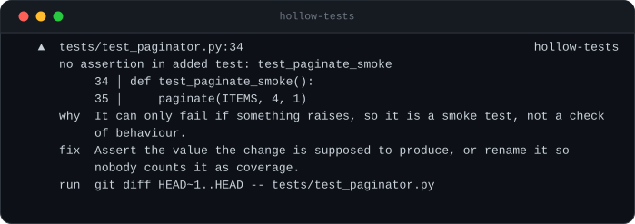
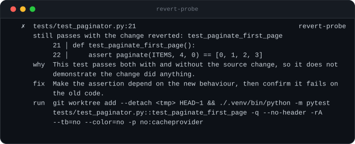
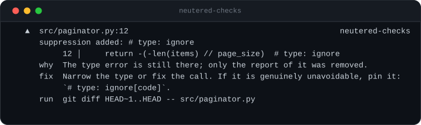
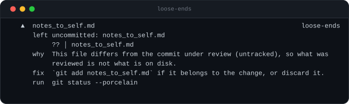

# unfaked

**Your agent said it's done. `unfaked` checks whether it made that true, or just made the check pass.**

[](https://pypi.org/project/unfaked/)
[](https://pypi.org/project/unfaked/)
[](LICENSE)
[](pyproject.toml)

<p align="center">
  
</p>

<sub>Generated from a real `unfaked` run, not a hand-written mockup:
`python scripts/render_svg.py` executes `examples/demo.py` and draws its output
verbatim, so the images here cannot drift from the tool.</sub>

A coding agent that cannot finish a task can always finish the *report*. It skips
the failing test, widens the assertion, wraps the crash in `except: pass`, or adds
tests that pass no matter what the code does. The suite goes green, the summary
says "all tests passing", and nothing was fixed.

`unfaked` reads the diff and the repository, never the agent's prose. Zero
dependencies, no API key, no LLM — every check is deterministic, and every
finding comes with a file, a line, and the command to reproduce it.

## Run it the moment your agent stops

```jsonc
// .claude/settings.json
{ "hooks": { "Stop": [ { "hooks": [
  { "type": "command", "command": "uvx unfaked -q --exit-zero" }
] } ] } }
```

Silent when there is nothing to report, the table only when there is — including
the revert probe below, which is what makes the hook worth having. Static checks
are **222 ms** on `anthropic-sdk-python`; the probe is given 20 seconds and says
so if it needs more, because the moment right after an agent says it is done is
not a place anyone waits.

Or let the agent check its own work before it reports back:

```console
npx skills add cmun2/unfaked
```

Add `--html-file .unfaked/report.html` and the same run also writes a
self-contained report you can open, attach to a review, or keep as a CI
artifact — one file, no CDN, no script.

→ [Claude Code hook](integrations/claude-code-hook.md) · [agent skill](skills/unfaked/SKILL.md) · [PR gate](integrations/github-action.yml)

## The check that matters

Static patterns catch the careless fakes. The **revert probe** catches the ones
that look fine:

> Put the source back the way it was, keep the tests the agent added, and run
> them. A test that passes both ways does not distinguish the change from
> the baseline.

This is the only way to catch a test that is *shaped* like a real test — real
assertion, real expected value, real green tick — but asserts something the old
code already did. A pass count can never see it. Reverting can.

`unfaked` refuses to guess here. If the comparison cannot be made — the tests
import something the change introduced, no runner is installed, `git worktree` is
unavailable — it says **"revert probe did not run"**, explains why, and reports
only what it can defend.

## Install

```console
uvx unfaked                     # no install
pipx install unfaked            # or keep it around
pip install unfaked
```

Python 3.9+. No dependencies, ever.

## Use

```console
unfaked                             # uncommitted work if there is any, else the last commit
unfaked --deep                      # also run the added tests against the old source
unfaked --head HEAD                 # a commit range, ignoring the working tree
unfaked --base main                 # everything since main
unfaked --scope 'src/**'            # flag edits outside the task you gave it
unfaked --json                      # machine-readable
```

An agent does not reliably stop on a commit, so neither does this. What gets
read is the files on disk whenever they differ from `HEAD`, and the last commit
when they do not — the header names which, every time. For a whole session,
record its starting point with `--session-start` and read from there with
`--session-file`.

**`--deep` never touches the tree it is checking.** The old source is checked out
into a throwaway `git worktree`, the tests under examination are copied on top,
and they run there. Uncommitted work is no obstacle, and nothing about the
original moves.

The default is **fast**: static checks only, no test run, well under a second
on the repos below. That is deliberate — the moment this is for is the one
right after an agent says it is done, and nothing that takes seven seconds
survives in that slot. `--deep` adds the revert probe, which re-runs your
suite once per added test. Keep it for review and CI.

Exit code is `1` when there is a FAIL and `0` otherwise, so it drops into CI
as-is. `--exit-zero` turns that off.

| flag | |
|---|---|
| `--base REF` | compare against `REF` (default `HEAD~1`) |
| `--head REF` | the reviewed revision (default `HEAD`) |
| `--scope GLOB` | files the task was allowed to touch; repeatable |
| `--fast` / `--deep` | static only (default), or add the revert probe |
| `--skip CHECK` / `--only CHECK` | pick checks; repeatable, comma-separated |
| `--json` | full report as JSON |
| `--json-file PATH` | write the JSON there and keep the report on stdout |
| `--no-color` | plain text (also honours `NO_COLOR`; auto-off when piped) |
| `-v` | show INFO findings as well |
| `-q` | one line when there is nothing to report (for hooks) |
| `--exit-zero` | always exit 0 |
| `--timeout SEC` | cap on each test run (default 600) |

## In CI

```yaml
- uses: actions/checkout@v7
  with:
    fetch-depth: 0          # --base needs the merge-base

- uses: cmun2/unfaked@v1
  with:
    install: pip install -e ".[dev]"
```

A pull request is where a test that proves nothing costs the most, and CI has
the time the agent hand-off does not, so `--deep` is the default here. The
report lands in the job summary and the verdict becomes an annotation on the
Files changed tab. `comment: true` posts it on the pull request instead,
updating the same comment rather than adding one per push.

| input | |
|---|---|
| `install` | shell that makes the tests runnable — the probe re-runs them |
| `base` / `head` | default to the pull request's base branch |
| `deep` | `false` for static checks only |
| `skip` / `only` | space-separated check names |
| `exit-zero` | report without failing the job |
| `comment` | post the report on the pull request |
| `timeout` | seconds the probe may spend (default 900) |

Outputs `fail`, `warn`, `headline` and `json` for later steps.

On an existing repository the first run usually finds something. To land the
gate without a red pull request queue, start with `exit-zero: true`, read the
summaries for a week, then take it off. `integrations/github-action.yml` is the
same thing written out as plain steps if you would rather not depend on an
action.

## What it checks

### `hollow-tests` — tests that cannot fail

<details>
<summary>What it looks like</summary>

<p align="center">
  
</p>

</details>

| | |
|---|---|
| test body is empty (`pass`, `...`) | **FAIL** |
| `assert True`, `assertTrue(True)`, `expect(true).toBe(true)` | **FAIL** |
| `assert x == x`, `expect(r).toBe(r)` — both sides the same expression | **FAIL** |
| the same, but both sides are calls (proves determinism, not correctness) | WARN |
| an added test with no assertion at all | WARN |
| an assertion that reads back a `return_value` the test itself set on a mock | WARN |

### `revert-probe` — do the new tests notice the change?

<p align="center">
  
</p>

Reverts the changed source files, re-runs *only* the tests the diff added, and
reports every one that still passes.

| | |
|---|---|
| a test passes both ways, and **nothing** the change added fails when reverted | **FAIL** |
| a test passes both ways, but something else the change added does fail without it | WARN |

The severity depends on the company it keeps, because a test that passes both
ways is a true observation and not automatically a fake — it is also exactly
what a *control* looks like, a test pinning the behaviour the change
deliberately left alone. If something else the change added fails when
reverted, the change is demonstrably tested and the survivors read as controls
worth a glance. If nothing added distinguishes the change, there is no innocent
reading left, and that is the case this tool exists for.

Tests that already fail on the committed code, or that the runner reports nothing
for, are listed as INFO — they are not evidence either way.

### `neutered-checks` — checks switched off instead of satisfied

<details>
<summary>What it looks like</summary>

<p align="center">
  
</p>

</details>

Anchored to lines the diff **added**, so a suppression that predates the change is
never reported.

| | |
|---|---|
| a specific assertion replaced with a vague one (`assertEqual` → `assertTrue`, `toEqual` → `toBeTruthy`) | **FAIL** |
| an assertion's expected value edited while nothing outside the tests changed | WARN |
| added skip/xfail: `@pytest.mark.skip`, `@pytest.mark.xfail`, `it.skip(`, `xit(`, `t.Skip(`, `#[ignore]`, `@Disabled` | WARN |
| added blanket suppression: bare `# noqa`, bare `# type: ignore`, `@ts-ignore`, `@ts-nocheck`, `# mypy: ignore-errors`, file-level `eslint-disable` | WARN |
| added silent handler: `except: pass`, `except Exception: pass`, `catch {}`, `catch (e) {}`, `.catch(() => {})` | WARN |
| those same suppressions when they name the rule they turn off (`# noqa: E402`, `# type: ignore[arg-type]`, `eslint-disable-next-line no-shadow`) | INFO |

### `loose-ends` — what the change left behind

<details>
<summary>What it looks like</summary>

<p align="center">
  
</p>

</details>

| | |
|---|---|
| files changed but not committed, or left untracked | WARN |
| files outside `--scope` | WARN |
| build output committed (`dist/`, `build/`, `*.min.js`, …) | WARN |
| a commit message claiming tests when no test file changed | WARN |
| a lockfile moved | INFO |

## Language support

**First class** — static checks *and* the revert probe:

- **Python** — pytest. Tests are found with the stdlib `ast` module, so discovery
  is exact. The probe runs under the repository's own pytest configuration,
  plugins like `xdist` included, so what it runs is what your CI runs.
- **JavaScript / TypeScript** — jest or vitest, whichever is in
  `node_modules/.bin`.

**Static only** — the diff-level checks in `neutered-checks` and `loose-ends` fire
for Go, Rust, Java, C#, Ruby and the rest, and the header says so
(`static-only: Go, Rust`). Test discovery and the revert probe do not run for
them. `unfaked` will not pretend otherwise.

## JSON

`--json` prints the whole report. Abridged:

```json
{
  "version": "0.1.0",
  "repo": "/tmp/unfaked-demo-7q4_8xd8/paginator",
  "base": "4ed85927b599193794d9c4916ac72e8c2d0385bf",
  "head": "3745a7857f2d1919cf92077889568b04e44b505b",
  "range": "HEAD~1..HEAD",
  "headline": "3 of the 5 tests it added still pass with the change reverted.",
  "files_changed": 2,
  "tests_added": 5,
  "runner": "pytest",
  "static_only_languages": [],
  "counts": {
    "fail": 3,
    "warn": 4,
    "info": 0
  },
  "exit_code": 1,
  "checks": [
    {
      "check": "revert-probe",
      "title": "do the new tests notice the change?",
      "status": "fail",
      "note": "5 of 5 added tests re-run with the change reverted (5 cases); 3 still passed",
      "stats": {
        "added": 5,
        "probed": 5,
        "survived": 3,
        "cases_probed": 5,
        "cases_survived": 3,
        "runner": "pytest"
      },
      "findings": [
        {
          "check": "revert-probe",
          "severity": "FAIL",
          "title": "still passes with the change reverted: test_paginate_first_page",
          "file": "tests/test_paginator.py",
          "line": 21,
          "snippet": [
            "21\tdef test_paginate_first_page():",
            "22\t    assert paginate(ITEMS, 4, 0) == [0, 1, 2, 3]",
            "23\t"
          ],
          "why": "This test passes both with and without the source change, so it does not demonstrate the change did anything.",
          "fix": "Make the assertion depend on the new behaviour, then confirm it fails on the old code.",
          "command": "git restore --source=HEAD~1 --worktree -- src/paginator.py && ./.venv/bin/python -m pytest tests/test_paginator.py::test_paginate_first_page -q --no-header -rA --tb=no -p no:cacheprovider",
          "extra": {
            "test": "test_paginate_first_page",
            "nodeid": "tests/test_paginator.py::test_paginate_first_page"
          }
        },
        "\u2026"
      ]
    }
  ]
}
```

## What you get that a prompt does not

Asking an agent to be honest routes the check through the thing being checked.
The agent that would report a hollow test as a passing test is the same agent
deciding whether it did. `unfaked` does not ask. It reverts your source and
re-runs the tests, and reads the diff rather than the summary.

The difference shows up most clearly in the failure people describe as an agent
"caving": push back hard enough — *"I think it should be X, isn't it?"* — and
some of them agree instead of checking. That has a shape in the diff, and five
of those shapes were run against this tool:

| what caving looks like in the code | caught |
|---|---|
| the assertion is weakened — `assertEqual` becomes `assertTrue` | **FAIL** |
| the expected value is edited to whatever the code already returns | **WARN** |
| the failing test is skipped | WARN |
| the crash is wrapped in `except: pass` | WARN |
| the correct change is simply reverted | **no** |

The last row is the honest limit. Reverting is also what a correct retraction
looks like, and nothing in the diff separates the two — `unfaked` does not read
the conversation, so it cannot know which one happened. It will not tell you
your agent was too agreeable. It tells you when agreement was written into the
tests.

## What it will not catch

Being honest about this is the point of the tool.

- **It never reads the agent's prose.** Natural-language parsing produces false
  positives, and one false positive costs more than ten misses. The only claim
  `unfaked` checks is one the repository can settle: a commit message promising
  tests when no test file changed.
- **A test that passes with the change reverted is not always wrong.** A
  regression test for behaviour that already worked is a legitimate thing to
  write. `unfaked` tells you which tests those are and why; it does not know your
  intent.
- **The revert probe needs a clean separation.** If source and test changes are
  tangled such that reverting the source breaks the import, the probe reports
  *inconclusive* rather than guessing. Separate commits for source and tests make
  it work.
- **The probe edits your working tree.** It restores the base revision of the
  changed source files, runs the tests, then puts them back — on every exit path,
  Ctrl-C included. It refuses to start if any file it would touch has uncommitted
  changes. `--skip revert-probe` avoids it entirely.
- **JS/TS test discovery is approximate.** Python uses a real parser; JS/TS uses a
  brace scanner that does not understand regex literals, and only finds
  `it()`/`test()` with a literal string title. When it is unsure it reports
  nothing — missed findings rather than false ones.
- **It does not run linters or type checkers.** It notices a suppression was
  added; it does not know whether the error underneath was real.
- **No cross-file reasoning.** A strong assertion deleted in one file and a weak
  one added in another is not connected.
- **Test-only and source-only commits cannot be probed.** There is nothing to
  revert, or nothing new to re-run.

## False positives

A false positive costs more than a miss: one bad call and nobody trusts the
output again. FAIL is reserved for things with no innocent reading; WARN is for
things usually worth a look; anything `unfaked` cannot back with a file, a line
and a command is not reported at all.

There is a benchmark, and you can run it:

```
python benchmark/run.py --deep
```

It builds 14 repositories from scratch — 10 with a planted problem, 4 honest
controls doing real work — and then runs the same checks over the last 25
commits of this repository, where every commit is real work rather than a
plant. One number matters in each direction:

```
fixtures — 14 generated repositories, probe included
  caught 10/10 · false alarms 0/4 controls

history — 15 real commits of this repository, probe included
  false-positive FAILs   0   (static checks only)
  probe reached a verdict 7 of 8 (88%)
  added tests that do not distinguish their change   7
    of those, in changes where nothing added does   2  (these block)
```

The fixtures are generated, so those numbers are fixed. The history numbers
move as this repository gains commits; the ones above are from `7b59138`, run
on a clean CI machine rather than quoted from a laptop. CI runs both corpora on
every change and fails the build if a planted problem is missed, a control is
flagged, or a static check fires on real work — so the two zeros are enforced
rather than reported.

Those last two lines are not an error rate, and they are the most interesting
numbers here. Seven tests written for this repository pass whether or not the
change they accompany is present — but in five of those seven cases, something
else the same change added *does* fail when reverted, so the change is
demonstrably tested and those five read as controls. `bc7060b` is one: it fixed
suppression matching inside string literals and added
`test_a_real_comment_is_still_a_suppression`, which asserts the behaviour that
was deliberately *not* changed. Passing both ways is what a control does, and
blocking on it would mean punishing the tool for being right.

The remaining two are the ones worth reading: nothing those changes added fails
when reverted. Those still block.

The false-positive number covers the static checks, which claim something did
happen. On 12 commits of real work they claim nothing: **0**.

Beyond the benchmark, three real repositories — 8 commits, all verified by hand
first — also produced **0 false-positive FAILs**. Run with `--deep`, so the
probe is included; the fast default would report it as `not run` on all three.

A fork of `anthropic-sdk-python`: a bug fix plus 9 new tests. This repository
runs pytest under `-n auto`, and pytest says this on every run:

```
INFO: inline-snapshot was disabled because you used xdist. This means that tests
with snapshots will continue to run, but snapshot(x) will only return x
```

Which is why counting green ticks is not enough: under xdist a snapshot
assertion is not doing what its author wrote. `unfaked` runs the probe under the
repository's own configuration — xdist included — and reports that all 9 tests do
fail with the fix reverted. They are real:

```
  unfaked  sdk  ·  HEAD~1..HEAD (90cf3c1a)
  2 files changed  ·  9 tests added  ·  pytest

  ▎ All 9 tests it added fail with the change reverted. They test the change.

  ✓ hollow-tests     tests that cannot fail                                        clean
  ✓ revert-probe     do the new tests notice the change?                           clean
  ✓ neutered-checks  checks switched off                                           clean
  ▲ loose-ends       what the change left behind                                  1 warn

  ──────────────────────────────────────────────────────────────────────────────────────

  ▲  uv.lock                                                                  loose-ends
     left uncommitted: uv.lock

           M │ uv.lock

     why  This file differs from the commit under review (modified, not staged), so
          what was reviewed is not what is on disk.
     fix  `git add uv.lock` if it belongs to the change, or discard it.
     run  git status --porcelain

  ──────────────────────────────────────────────────────────────────────────────────────
  1 warn                                                                          exit 0
```

A fork of `anthropic-sdk-typescript`: a bug fix plus one jest test:

```
  unfaked  ts-sdk  ·  HEAD~1..HEAD (a726e99)
  2 files changed  ·  1 test added  ·  jest

  ▎ The one test it added fails with the change reverted. It tests the change.

  ✓ hollow-tests     tests that cannot fail                                        clean
  ✓ revert-probe     do the new tests notice the change?                           clean
  ✓ neutered-checks  checks switched off                                           clean
  ▲ loose-ends       what the change left behind                                  1 warn

  ──────────────────────────────────────────────────────────────────────────────────────

  ▲  package-lock.json                                                        loose-ends
     left uncommitted: package-lock.json

          ?? │ package-lock.json

     why  This file differs from the commit under review (untracked), so what was
          reviewed is not what is on disk.
     fix  `git add package-lock.json` if it belongs to the change, or discard it.
     run  git status --porcelain

  ──────────────────────────────────────────────────────────────────────────────────────
  1 warn                                                                          exit 0
```

A 28-file research-repository commit whose suite is a set of standalone scripts
rather than pytest functions. `unfaked` says so instead of inventing a verdict:

```
  unfaked  mcp-schema-compat-poc  ·  HEAD~1..HEAD (2a8fc96)
  28 files changed  ·  0 tests added

  ▎ Nothing faked found. 1 thing worth a look.

  ✓ hollow-tests     tests that cannot fail                                        clean
  ? revert-probe     do the new tests notice the change?                         not run
    no tests were added in this range, so there is nothing to re-run
  ✓ neutered-checks  checks switched off                                           clean
  ▲ loose-ends       what the change left behind                                  1 warn

  ──────────────────────────────────────────────────────────────────────────────────────

  ▲  .DS_Store                                                                loose-ends
     left uncommitted: .DS_Store

           M │ .DS_Store

     why  This file differs from the commit under review (modified, not staged), so
          what was reviewed is not what is on disk.
     fix  `git add .DS_Store` if it belongs to the change, or discard it.
     run  git status --porcelain

  ──────────────────────────────────────────────────────────────────────────────────────
  1 warn · 5 info                                          5 info hidden · -v  ·  exit 0
```

The suite in `tests/` is built on the same principle: every check has a
repository where it must fire and a near-identical control where it must not.

```console
python -m unittest discover -s tests -t tests
```

## Why no LLM

Because a check you cannot reproduce is not a check. Every finding here is a
file, a line, and a command you can run yourself. A model would add an API key, a
bill, latency, and a second opinion that is wrong in ways you cannot predict — to
a tool whose whole job is being trustworthy about correctness.

## License

MIT
